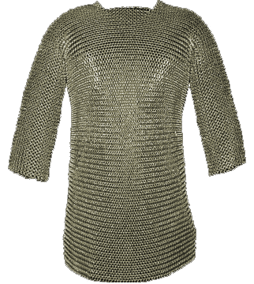

# Byrnie 

Weaving Mithril into beautiful components

Weaving the safe, lightning speed and robust brillance of [Mithril](https://lhorie.github.io/mithril/) with the syntax sugar and integration freedom of [Riot](https://muut.com/riotjs/) to help you journey beyond the mordor shadow of current web realities to component hopes of the future.

## Tool Overview

Area | Byrnie | Mithril | Riot | React | Polymer | Vue | Angular
--- | --- | --- | --- | --- | --- | --- | ---
Weight <sup>minified</sup> | 16k<sup>*1</sup> | 16k | 5k | 127k | 120k | 18k | 49k
Virtual DOM | Yes | Yes | Yes | Yes | No | No | No
Compatibility | IE6+<sup>2</sup> | IE6+<sup>2</sup> | IE8+<sup>2</sup> | IE8+ | IE10+ | IE9+ | IE8<sup>3</sup>, IE9<sup>4</sup>, IE11+<sup>5</sup>
Binding | choice | choice | choice | one-way | two-way | two-way | two-way
[Load Speed](https://lhorie.github.io/mithril/benchmarks.html) | 0.28ms<sup>1</sup> | [0.28ms](https://lhorie.github.io/mithril/index.html) | n/a<sup>6</sup> | [25ms](https://lhorie.github.io/mithril/index.html) | n/a<sup>6</sup> | n/a<sup>6</sup> | [7.5ms](https://lhorie.github.io/mithril/index.html)
[TodoMVC](https://matt-esch.github.io/mercury-perf/) | 127ms<sup>1</sup> | [127ms](https://github.com/muut/riotjs/issues/186) | [594ms](https://github.com/muut/riotjs/issues/186) | [820ms](https://github.com/muut/riotjs/issues/186) | n/a<sup>6</sup> | [259ms](https://github.com/muut/riotjs/issues/186) | [1,742ms](https://github.com/muut/riotjs/issues/186)
Template Safety | [Yes](https://lhorie.github.io/mithril/index.html)<sup>1</sup> | [Yes](https://lhorie.github.io/mithril/index.html) | n/a<sup>7</sup> | n/a | n/a | n/a | [No](https://lhorie.github.io/mithril/index.html)

##### As a quick overview corrections and clarifications are welcome :-)

Notes:

1. Assumed the same as Mithril at this stage of development
2. With approperate shim
3. Angular 1.2.x supports IE8 without IE8 issue support
4. Angular 1.3.x supports IE9+
5. Angular 2.x will [support modern browsers that auto update](http://www.infoq.com/news/2014/03/angular-2-0) (IE11+)
6. Un-available. [TodoMVC Pref](https://github.com/matt-esch/mercury-perf/) needed
7. Dependant upon at least the

## Byrnie name

Pronounced: [bur-nee], a byrnie is a scottish variant for [coat of mail armour or hauberk](http://dictionary.reference.com/browse/byrnie)

## Logo 

Licensing ```labeled for reuse with modification``` by [Google images](https://www.google.com/search?tbs=sur:fmc&tbm=isch&q=silver+mail+armour+sword+and+armory+blog) on 2015-01-29

## License: MIT
